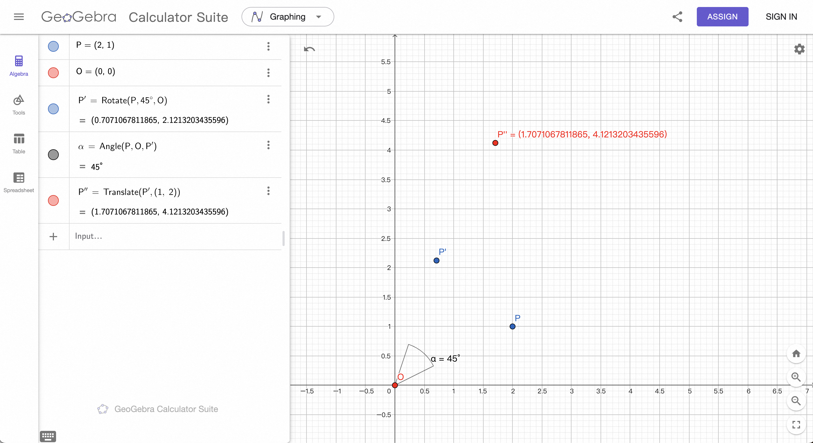

# GAMES101 - Assignment 0

> I modified the original CMakeLists.txt to work with my environment without using the GAMES101 VM.

## Lecture 03 Transformation

https://sites.cs.ucsb.edu/~lingqi/teaching/resources/GAMES101_Lecture_03.pdf

## Matrix Transformations

https://www.geogebra.org/m/sqG26hQj

## Result

```
Final point is P'=(1.70711,4.12132)
```

### Validation

With using the geogebra link above, we can verify the program output:

