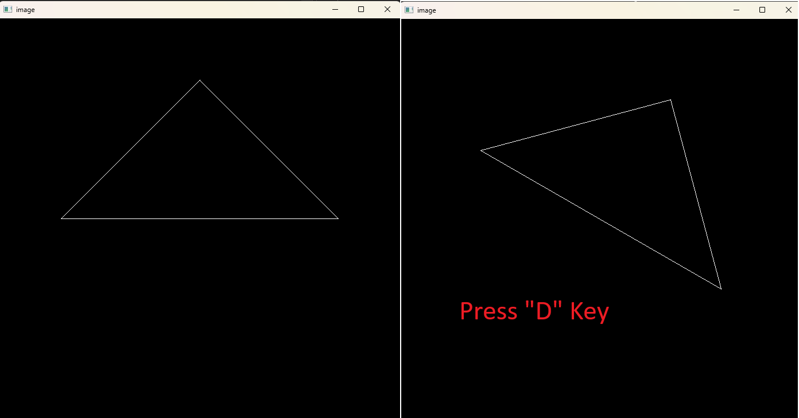

# Assignment 1: Rotation and Projection

## Task

### `get_model_matrix()`

- Implement a function to create a model matrix for a given rotation angle.

### `get_projection_matrix()`

- Implement a function to create a projection matrix for a given field of view and aspect ratio.
  1. Finding the `l, r, b, t, n, f` values based on `eye_fov` and `aspect_ratio`.
     - FOV = tan(x/2) = t / |n|, where x is the vertical FOV angle
     - aspect_ratio = (r - l) / (t - b)
     - The projection matrix is for a general frustum, assume the viewing volume is symmetric. Then we have `r + 1 = 0, t + b = 0 => r = -l, t = -b`  [(reference)](https://math.stackexchange.com/questions/4522384/how-is-aspect-ratio-used-in-perspective-projection)
  2. Construct the projection matrix using the derived values.

  3. For the Z-Near and Z-Far:
     - [Reference](https://stackoverflow.com/questions/28286057/trying-to-understand-the-math-behind-the-perspective-matrix-in-webgl)
     - In here, take the - sign convention for z-axis, so that the camera looks towards the negative z-axis.
     - From the formula we use is assuming the camera is looking towards the negative z-axis and the near and far planes are at -zNear and -zFar respectively.

### [Not yet implemented] A rotation matrix for rotating a point or vector around an arbitrary axis

- Using the Rodrigues' rotation formula, implement a function to rotate a point or vector around an arbitrary axis.

## Result

## Reference

<https://people.computing.clemson.edu/~dhouse/courses/405/notes/projections.pdf>

<https://math.stackexchange.com/questions/4522384/how-is-aspect-ratio-used-in-perspective-projection>

<https://stackoverflow.com/questions/28286057trying-to-understand-the-math-behind-the-perspective-matrix-in-webgl>
