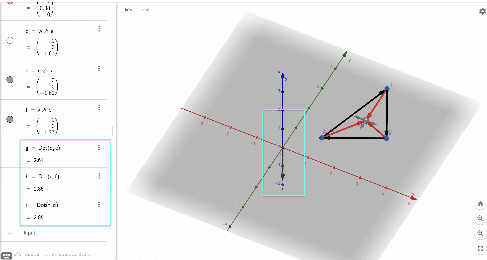
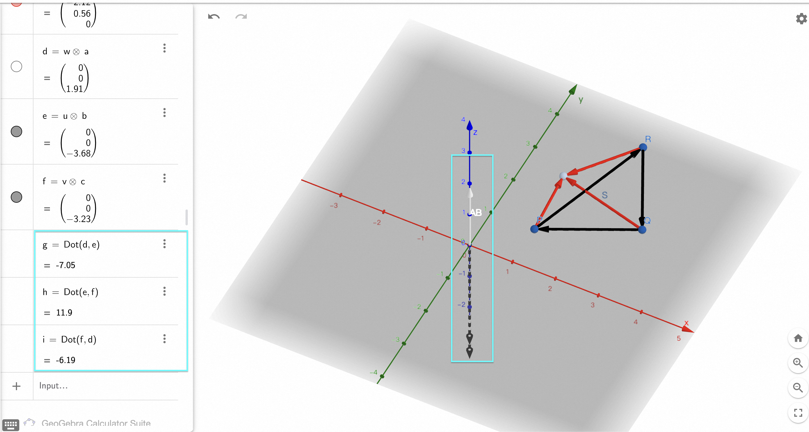
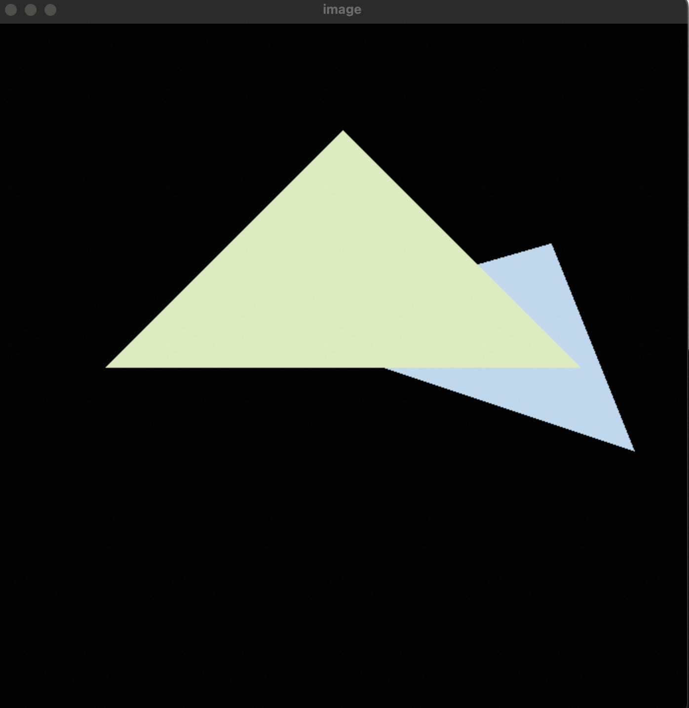

# Assignment 2: Triangles and Z-buffering

## Task

## Cross Product (Sign Test) explanation

> Reference: [Point in triangle test](https://blackpawn.com/texts/pointinpoly/)

The basic idea of the cross product method is to use cross products to check the point P is on the Top of Edge AB or Bottom of Edge AB. (In cross product, it means pointing up or down.)

To figure out whether the point P should "Top" or "Bottom", we can use the dot product with a reference edge cross product. Then if they are all in the same direction, all the values of the cross product will be positive, otherwise, it will be negative. (Because poining to the same direction means theta = 0)

## [Not tested] Common methods of isInsideTriangle()

During my self-study, I found that there are many different ways to check whether the point P inside or outside the triangle. At the beginning, I was confused by the various methods. After some reading and just asking the AI, it summarized the common method below:

| Method                        | Performance | Numerical Stability | Implementation Difficulty | Best Applications                                                                          |
| ----------------------------- | ----------- | ------------------- | ------------------------- | ------------------------------------------------------------------------------------------ |
| **Barycentric Coordinates**   | ⭐⭐⭐⭐⭐       | ⭐⭐⭐⭐⭐               | ⭐⭐⭐                       | • Ray tracing • Texture mapping • Interpolation • GPU shaders                     |
| **Cross Product (Sign Test)** | ⭐⭐⭐⭐⭐       | ⭐⭐⭐⭐                | ⭐⭐⭐⭐⭐                     | • Real-time graphics • Game engines • Collision detection • Simple UI hit testing |
| **Area Comparison**           | ⭐⭐⭐         | ⭐⭐⭐                 | ⭐⭐⭐                       | • Educational purposes • Geometric analysis • Non-performance critical apps          |
| **Same Side Method**          | ⭐⭐⭐⭐        | ⭐⭐⭐⭐                | ⭐⭐⭐⭐                      | • 3D graphics • Geometric libraries • CAD applications                               |
| **Ray Casting**               | ⭐⭐          | ⭐⭐⭐                 | ⭐⭐                        | • General polygon testing • Complex shape analysis • Not recommended for triangles   |
| **Coordinate Transformation** | ⭐⭐          | ⭐⭐                  | ⭐⭐                        | • Batch processing • Preprocessing scenarios • Academic research                     |

### Computational Cost (Operations Count)
| Method | Multiplications | Additions | Comparisons | Special Operations |
|--------|----------------|-----------|-------------|-------------------|
| Barycentric Coordinates | 8-12 | 6-8 | 3-4 | 2 divisions |
| Cross Product | 6 | 3 | 3 | None |
| Area Comparison | 12-15 | 8-10 | 1 | 4 area calculations |
| Same Side | 9 | 6 | 3 | 3 dot products |
| Ray Casting | 4-8 | 2-4 | 2-6 | Line intersection tests |
| Coordinate Transformation | 12+ | 8+ | 3 | Matrix operations |

## Result

## Reference
