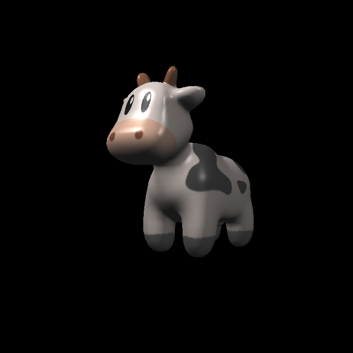
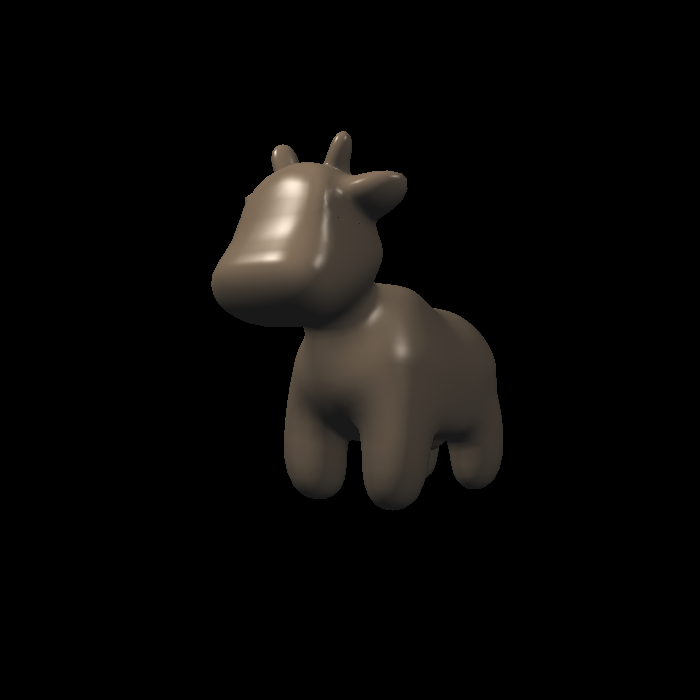
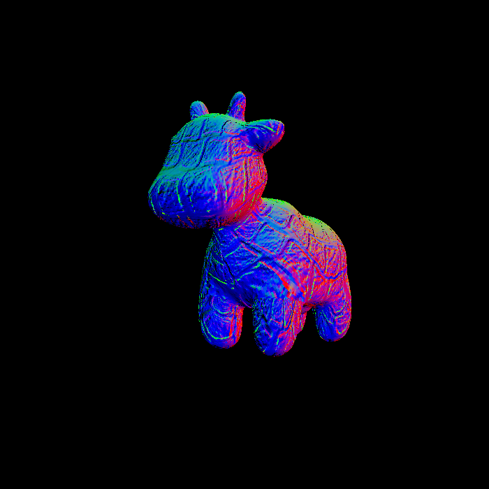
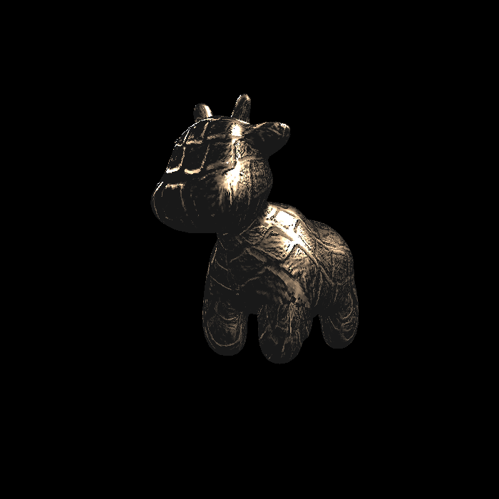

# Assignment 3: Pipeline and Shading

## Task

Basically to implement Normal, Texture, Phong, Bump, and Displacement mapping in a 3D rendering pipeline. For the detail, you may refer to the main.cpp comment. The advanced task is not yet implemented, I may complete it after I really know what is the TBN matrix first LOL.

## Result

## Reference

- [Bump Map](https://www.slideshare.net/slideshow/bump-mapping/74531555#5)
