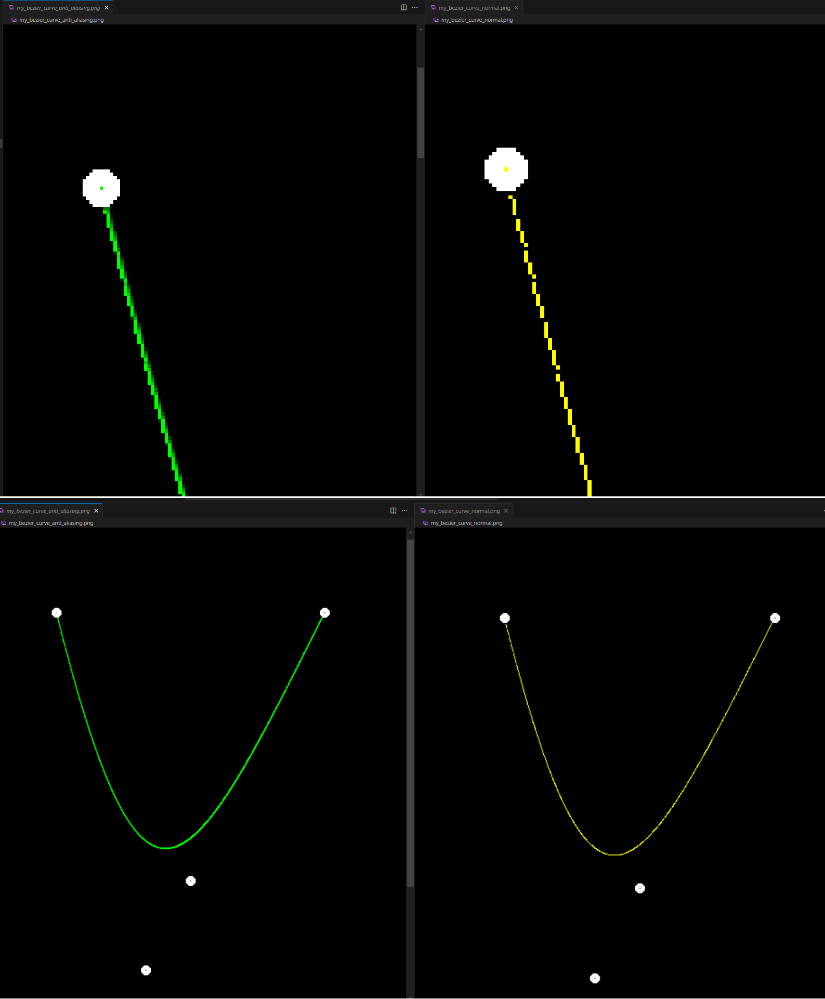

# Assignment 4: Bézier curve

## Task

I modified some of the main code for me to easily debug, but it would not affect the main logic.

### Bézier curve - de Casteljau algorithm

Very easy, just follow the de Casteljau algorithm

### Antialiasing - Bilinear interpolation weighted mean

We using the centre of pixel as the point, so point to point distance is **1**, the sum of area of the rectangle would be 1, so I just skip the division part.

```C++
int x_upper = floor(point.x) + 1;
int y_upper = floor(point.y) + 1;
cv::Point2i p00 = cv::Point2i(floor(point.x), floor(point.y));
cv::Point2i p01 = cv::Point2i(x_upper, floor(point.y));
cv::Point2i p10 = cv::Point2i(floor(point.x), y_upper);
cv::Point2i p11 = cv::Point2i(x_upper, y_upper);
...
auto w0 = (x_upper - point.x) * (y_upper - point.y);
...
// Final color
window.at<cv::Vec3b>(p00.y, p00.x)[1] = MIN(255, window.at<cv::Vec3b>(p00.y, p00.x)[1] + 255.0f * w0);
```


## Result



## Reference

- [Bilinear interpolation](https://en.wikipedia.org/wiki/Bilinear_interpolation)
