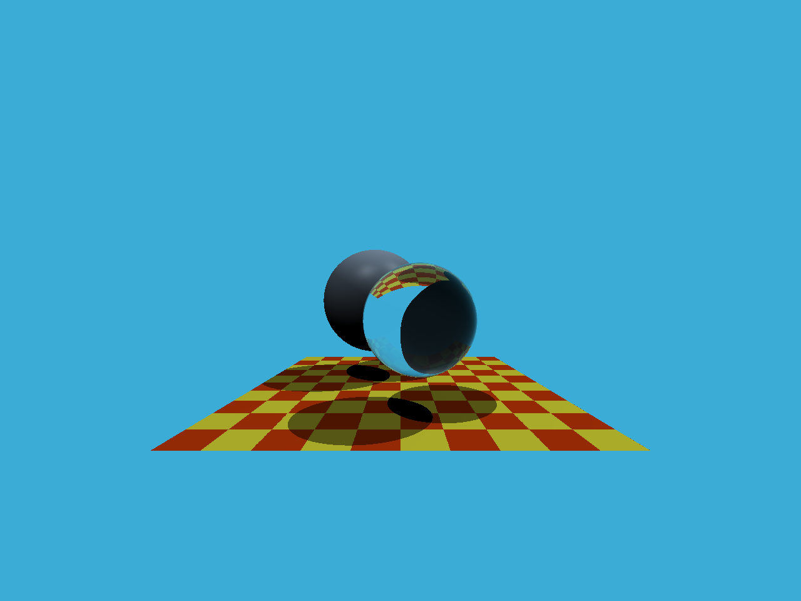

# Assignment 5: Ray Tracing

## Task

### Renderer.cpp - Render()

The idea of the Ray Tracing is to cast rays **from the screen to the objects** and check for intersections. The color of each pixel is determined by the closest intersection point along the ray.


For each pixel in the screen, casting a ray from the camera through the pixel.

```C++
for (int j = 0; j < scene.height; ++j)
{
  for (int i = 0; i < scene.width; ++i)
  {
    ...
    // i and j are the pixel coordinates
    // x and y are the position ray from the camera to the world
    Vector3f dir = normalize(Vector3f(x, y, -1));
    framebuffer[m++] = castRay(eye_pos, dir, scene, 0);
  }
}
```

For our task, is going to convert the pixel coordinates `(i, j)` to world coordinates `(x, y)`.

#### Relationship between space and our screen

> The following definition is not same as scratchapixel

- How does the space relate to the screen?

```shell
Screen space
     ⇅ (Viewport Transform)
NDC space
     ⇅ (Perspective Division)
Clip space
     ⇅ (Projection Matrix)
Camera space
```

#### Screen, NDC and Camera

~~Defing the position of the pixel as `(x + 0.5, y + 0.5)`, where `x` and `y` are the screen coordinates. The `+ 0.5` is to center the pixel.~~

> Depending on the definition of the pixel coordinates, the pixel coordinates may be defined as `(x, y)` or `(x + 0.5, y + 0.5)`. The `+ 0.5` is to center the pixel in the middle of the pixel.

The NDC space is a cube with coordinates ranging from `[-1, 1]` in all three axes.

> The center may not define as the pixel coordinates, some books may use the top-left corner as the origin, so the pixel coordinates are `(x, y)`.

The relationship between the screen space and NDC space is:

```shell
# From NDC to Screen
screen_pixel_x = (NDC_x + 1) * screen_width / 2
screen_pixel_y = (NDC_y + 1) * screen_height / 2
NDC_x = (screen_pixel_x / screen_width) * 2 - 1
NDC_y = (screen_pixel_y / screen_height) * 2 - 1

# From NDC to Camera, camera_z = -1 as the position of the camera is at the origin looking towards the negative z-axis.
camera_x = ndc_x * scale * imageAspectRatio * abs(camera_z) = ndc_x * scale * imageAspectRatio
camera_y = ndc_y * scale * abs(camera_z) = ndc_y * scale
```


As a result, the x and y coordinates of the ray in the camera space can be calculated as:

> In here, the value of `y` times `-1` to flip the y-axis, as most image formats and framebuffer representations, the pixel at row j = 0 is the top-most row of the final image.
> Processing image rows from top to bottom while calculating ray directions from bottom to top will flips the final image.

```C++
// Assume the pixel coordinates are (i, j)
float x = ((i / (float)scene.width) * 2 - 1) * scale * imageAspectRatio;
float y = -(((j / (float)scene.height) * 2 - 1) * scale);

// Assume the pixel coordinates are (i + 0.5, j + 0.5)
float x = (((i + 0.5) / (float)scene.width) * 2 - 1) * scale * imageAspectRatio;
float y = -(((j + 0.5) / (float)scene.height) * 2 - 1) * scale;
```

### Triangle.hpp - rayTriangleIntersect()

The basic idea is to use the Möller–Trumbore algorithm to find the intersection of a ray and a triangle. The algorithm uses the cross product to find the intersection point and checks if it lies within the triangle.

#### Process

- Baricentric Interpolation
  - For a **point** `p` inside a triangle △ABC, can be expressed as:
    - `p = αA + βB + γC`, `α + β + γ = 1`
    - where `α`, `β`, and `γ` are the barycentric coordinates of the point with respect to the triangle vertices A, B, and C.
  - We got: `α = (1 - β - γ)`

- Ray Equation: `r(t) = o + td`
  - `r(t)` is the **point** (ray) at time `t`
  - `o` is the origin of the ray
  - `d` is the direction of the ray

- If intersection exists, we can express the intersection point as:
  - `r(t) = o + td = (1 - β - γ)A + βB + γC`
    - `A`, `B`, and `C` are the vertices of the triangle
    - `o` is the origin of the ray
    - `d` is the direction of the ray
    - Unknowns are `t`, `β`, and `γ`. ***<- we need to solve for these.***

- Rearranging gives us:  
  - `o + td = (1 - β - γ)A + βB + γC`
  - `o + td = A - βA - γA + βB + γC`
  - `o + td = A + β(B - A) + γ(C - A)`
  - `o - A = β(B - A) + γ(C - A) - td`
  - We got the following system of equations in x, y, z:
  - `T = βE0 + γE1 - td`
    - where `E0 = B - A`, `E1 = C - A`, and `T = o - A`

- We can express this as a matrix equation:

```shell
  | E0.x  E1.x  -d.x |   | β |   | T.x |
  | E0.y  E1.y  -d.y | * | γ | = | T.y |
  | E0.z  E1.z  -d.z |   | t |   | T.z |
```

- By applying Cramer's Rule, we can solve for `β`, `γ`, and `t`:


```shell
          | E0.x  E1.x  -d.x |
  D = Det | E0.y  E1.y  -d.y |
          | E0.z  E1.z  -d.z |

  det(β) = | T.x  E1.x  -d.x |
           | T.y  E1.y  -d.y |
           | T.z  E1.z  -d.z |

  det(γ) = | E0.x  T.x  -d.x |
           | E0.y  T.y  -d.y |
           | E0.z  T.z  -d.z |

  det(t) = | E0.x  E1.x  T.x |
           | E0.y  E1.y  T.y |
           | E0.z  E1.z  T.z |

  β = det(β) / D
  γ = det(γ) / D
  t = det(t) / D  

# At last, by the triple product, we got
# https://en.wikipedia.org/wiki/Triple_product

D = E0 · (E1 × -d)
β = T · (E1 × -d) / D
γ = E0 · (T × -d) / D
t = E0 · (E1 × T) / D
```

After calculating `β`, `γ`, and `t`, we can check if the intersection point lies within the triangle by ensuring that `β >= 0`, `γ >= 0`, and `β + γ <= 1`. If these conditions are met, we have a valid intersection.

## Result

> [!NOTE]  
> I updated the floating point solution, actually we have to use the scene.epsilon value as the offset

> There is some slight difference in the output images depending on the definition of the pixel coordinates. For the noise problem (some artifacts in the image), it happened because of the floating point problem, you may refer to the references part for more detail.
>
> https://zhuanlan.zhihu.com/p/610959851

### After we apply the epsilon value



### If we assume the pixel coordinates are `(i, j)`


### If we assume the pixel coordinates are `(i + 0.5, j + 0.5)`


## Reference

https://zhuanlan.zhihu.com/p/451582864

https://zhuanlan.zhihu.com/p/448575965

https://zhuanlan.zhihu.com/p/610959851

https://www.geeksforgeeks.org/maths/cramers-rule/

https://blog.csdn.net/Q_pril/article/details/123825665

https://www.scratchapixel.com/lessons/3d-basic-rendering/ray-tracing-generating-camera-rays/generating-camera-rays.html
