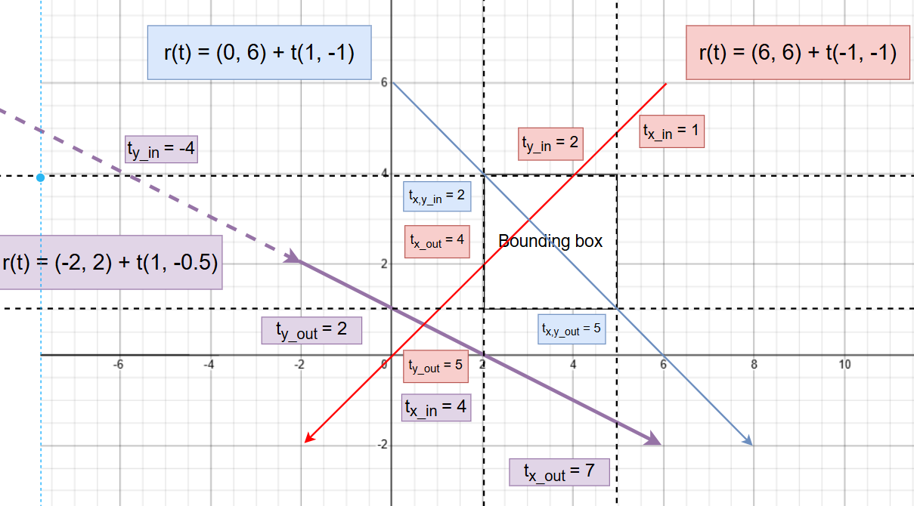

# Assignment 6: Ray Tracing - AABB Bounding Box Acceleration

## Task

### Bounds3.hpp - IntersetP()

The basic idea is to check if a ray intersects with an Axis-Aligned Bounding Box (AABB). The AABB is defined by its minimum and maximum corners, and the ray is defined by its origin and direction.

For example, using 2D for simplicity, we can visualize the intersection of a ray with an AABB as follows:



|   Ray  |   x_in  |   y_in  |  x_out  |  y_out  | in < out? |
|:------:|:-------:|:-------:|:-------:|:-------:|:---------:|
|  Blue  |    2    | **_2_** | **_5_** |    5    |     O     |
|   Red  |    1    | **_2_** | **_4_** |    5    |     O     |
| Purple | **_4_** |    -4   |    7    | **_2_** |     X     |

> Take the max(x_in, y_in) and min(x_out, y_out) to determine if the ray intersects the AABB.

In the Bounds3.hpp, we need to implement the AABB intersection test function `IntersectP()`

```C++
inline bool Bounds3::IntersectP IntersetP(const Ray& ray, const Vector3f& invDir, const std::array<int, 3>& dirIsNeg);

// ray is the ray to test for intersection
// invDir is the inverse of the ray direction
// dirIsNeg is an array indicating if the ray direction is negative in each axis
```

#### Use of invDir

- In the intersection test, we need to compute the t values for each axis to determine if the ray intersects the AABB. To speed up the computation, we can use the inverse of the ray direction (`invDir`)

```shell
intersect_point = origin + t * ray_direction
t = (intersect_point - origin) / ray_direction
t = (intersect_point - origin) * (1 / ray_direction)
t = (intersect_point - origin) * invDir
```

#### Use of dirIsNeg

Looking back to the example, the Blue ray and the Red ray both intersect the AABB, but their in and out axes are different. If we directly use the min and max of the intersection points, we might get incorrect results.

> Using the Blue ray as an example:
>
> max of t values from MIN planes: max(4, 5) = 5
>
> min of t values from MAX planes: min(1, 2) = 1
>
> Check: 5 < 1 = false (IT IS WRONG)

Therefore, we need to check the intersection points based on the ray direction. The `dirIsNeg` array indicates if the ray direction is negative in each axis. If it is negative, we need to swap the min and max values.

```C++
if (ray.direction.x > 0) {
    tmin_x = (pMin.x - ray.origin.x) * invDir.x;
    tmax_x = (pMax.x - ray.origin.x) * invDir.x;
} else {
    tmin_x = (pMax.x - ray.origin.x) * invDir.x;
    tmax_x = (pMin.x - ray.origin.x) * invDir.x;
}
```

Or we can jsut simply sort and check all t values, [reference](https://zhuanlan.zhihu.com/p/475966001):

```C++
Vector3f t1 = (pMin - ray.origin) * invDir;
Vector3f t2 = (pMax - ray.origin) * invDir;
Vector3f tMin = Vector3f::Min(t1, t2); // Found the tMin collection
Vector3f tMax = Vector3f::Max(t1, t2); // Found the tMax collection
float tEnter = 0.0;
float tExit = 0.0;
tEnter = std::max(tMin.x, std::max(tMin.y, tMin.z));
tExit = std::min(tMax.x, std::min(tMax.y, tMax.z)); 
return tEnter < tExit && tExit >= 0;
```

**The point is the direction of the ray is important, need to check which set is the in direction and which set is the out direction.**

### BVH.cpp - getIntersection()

## Result

## Reference

https://zhuanlan.zhihu.com/p/475966001
